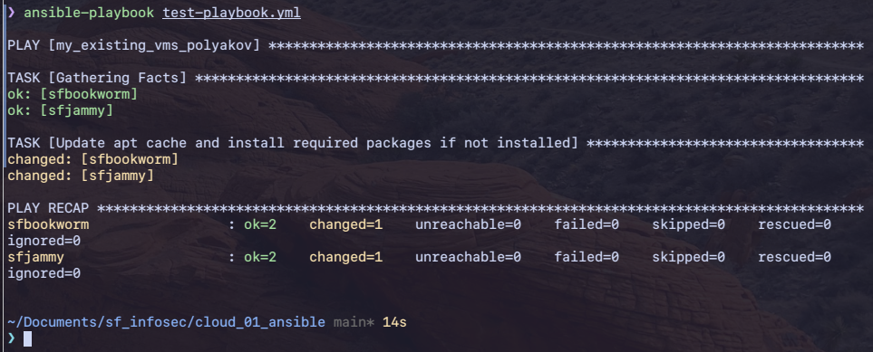
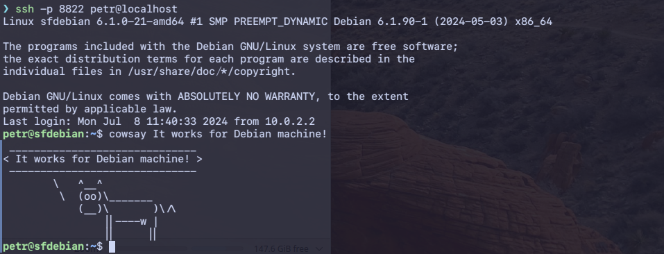
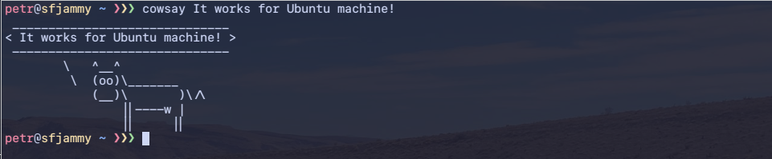
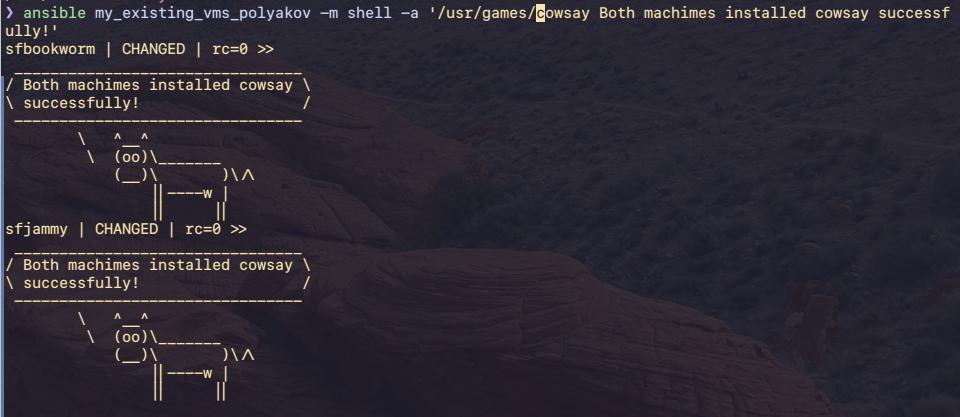

# Ansible - simple task

## The Task

Напишите playbook для установки на устройство следующих пакетов:

- cmatrix,
- cowsay,
- sl.

```yaml
- hosts: my_existing_vms_polyakov
  become: yes
  tasks:
    - name: Update apt cache and install required packages if not installed
      ansible.builtin.apt:
        update_cache: yes
        pkg:
          - cmatrix
          - cowsay
          - sl
```

Устройство нужно включить в группу со своей фамилией в качестве названия:

```
[my_existing_vms_polyakov]
sfjammy ansible_host=127.0.0.1 ansible_user=petr ansible_port=9922 ansible_sudo_pass=123
sfbookworm ansible_host=127.0.0.1 ansible_user=petr ansible_port=8822 ansible_sudo_pass=123

```

<details>
<summary>Screenshots</summary>









</details>

## УСЛОВИЯ РЕАЛИЗАЦИИ

В качестве ответа предоставьте:

- [ ] файлы конфигурации ansible.cfg, [hosts](./hosts);
- [x] файл [playbook](./test-playbook.yml);
- [x] скриншот вывода результатов работы PLAY.

Все результаты необходимо загрузить на свой GitHub и прикрепить ссылку на репозиторий в качестве ответа.
